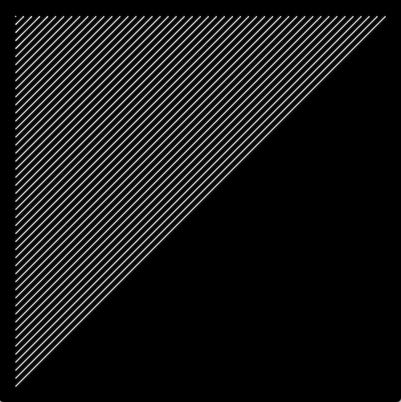
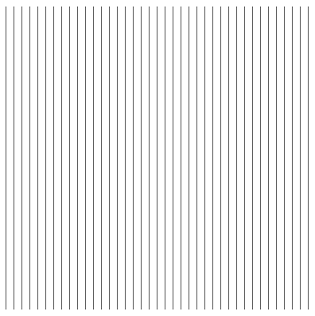
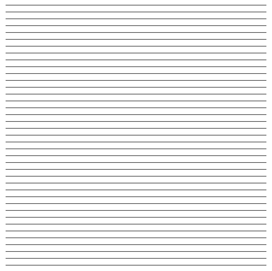
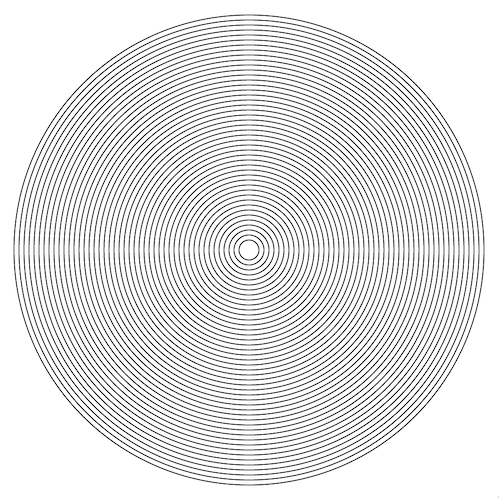
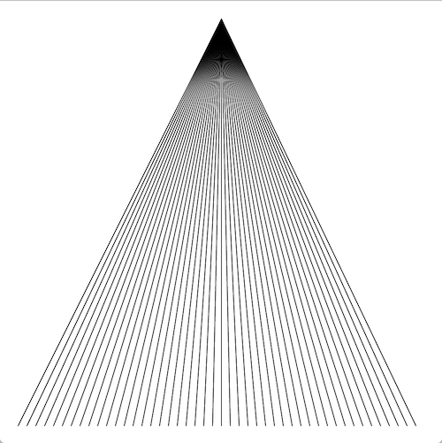
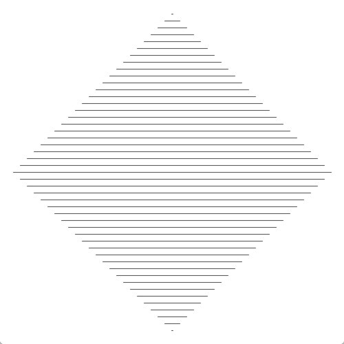
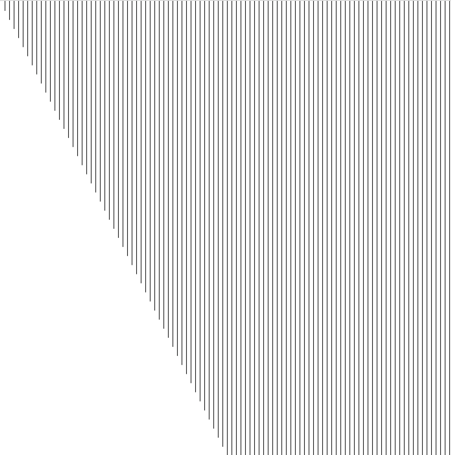
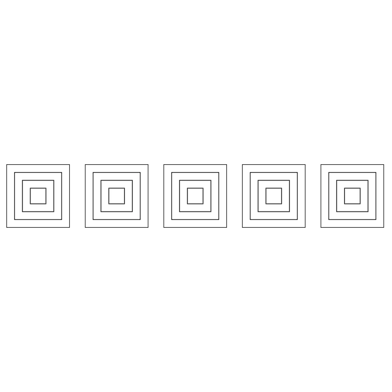
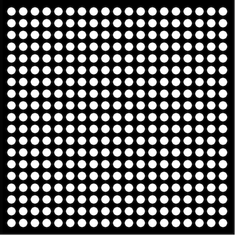

## Homework 5 (due Friday, October 12, 2018)

You will be submitting each homework assignment into a new GitHub repository each week. [Here are instructions on how to do so.](https://github.com/zamfi/github-guide/blob/master/README.md) Please email me if you have any questions.

### Using a local editor

Consider using a local editor, such as Atom, to complete your homework.  You'll be editing an HTML file that has JavaScript code in it, rather than editing a file on the online editor that only has the JavaScript code.  For a template of an HTML file to use, see the bubbles.html example from the first class.

After you've made changes in your local editor to a file, remember to re-save the file, flip over to your web browser, and re-fresh the page to see the new changes.  Also remember to open the browser's JavaScript console to see any errors in your code the browser finds.

If you't not comfortable using a local editor, or if you run into problems, you can continue to use `editor.p5js.org` to complete your homework.

### Classwork Wrap-up

In class, we started writing a clone of the classic game Pong. Here's an expanded set of code that's missing a few pieces to be complete:

```javascript

var scoreL = 0;
var scoreR = 0;

const paddleWidth = 10;
const paddleHeight = 50;
const paddleSpeed = 5;

var ball = {
    x: 200,
    y: 300,
    radius: 10,
    dx: -1,
    dy: 1,
}

var paddleL = {
    y: 100,
}

var paddleR = {
    y: 100,
}

function setup() {
    createCanvas(400, 400);
}

function draw() {
    background(200);

    // draw the puck, the left paddle, and the right paddle
    ellipse(ball.x, ball.y, ball.radius*2);
    rect(0, paddleL.y, paddleWidth, paddleHeight);
    rect(width - paddleWidth, paddleR.y, paddleWidth, paddleHeight);

    // Update ball position
    ball.x += ball.dx;
    ball.y += ball.dy;

    // Check if ball is bouncing off bottom
    if (ball.y + ball.radius >= height) {
        ball.y = height - ball.radius;
        ball.dy = ball.dy * -1;
    }

    // Check if ball is bouncing off top
    if (ball.y - ball.radius <= 0) {
        // ????  Add code
    }

    // Check if ball is hitting right paddle
    if (paddleR.y <= ball.y && ball.y <= paddleR.y + paddleHeight && ball.x + ball.radius >= width - paddleWidth)
    {
        ball.x = width - paddleWidth - ball.radius;
        ball.dx = ball.dx * -1;
    }

    // Check if ball is hitting left paddle
    if (?????)
    {
        // ???? Add code
    }

    // Check if the ball is off the screen
    if (ball.x < 0) {
        fill(255, 0, 0);
        textSize(20);
        text("Left Player Lost", 100, 100);
        noLoop();
    }

    if (??????) {
        fill(255, 0, 0);
        textSize(20);
        text("Right Player Lost", 100, 100);
        noLoop();
    }

    // Check for user input

    // Letter Q
    if (keyIsDown(81)) {
        paddleL.y -= paddleSpeed;
        if (paddleL.y < 0) {
            paddleL.y = 0;
        }
    }

    // Letter A
    if (keyIsDown(65)) {
        paddleL.y += paddleSpeed;
        if (paddleL.y > height - paddleHeight) {
            paddleL.y = height - paddleHeight;
        }
    }

    // Up arrow
    if (keyIsDown(38)) {
        // ????  Add code
    }

    // Down arrow
    if (keyIsDown(40)) {
        // ???? Add code
    }

}
```

Some notes about the code:

- When the ball goes off the screen, indicating one of the players has scored, the program prints text to the screen using the `text()` and `textSize()`.  Look up those functions in the P5 reference.

- When one player scores, the program calls the `noLoop()` function to stop the program. We haven't used this in class before, but it basically tells P5 to stop calling our `draw()` function to draw another animation frame.

- When your program is running, you may need to click the mouse on the animation canvas to "focus" the user input there before you can move the paddle with the keyboard.

**Assignment**: Replace all the `???` comments above to create a (basic) functional version of Pong! You should be able to pattern-match your way through the task -- for pieces that are missing, compare the missing bit of code to a similar section of code that's present elsewhere in the program. Save your completed Pong game in your homework repo as `pong.html` (if you were using a local editor) or `pong.js` (if you were using the online P5 editor).  Do as much as you can, and submit what you have even if you can't finish it!

**Optional Challenges**:

Once you have the basic game functionality working, you can add code to flush the game out a little more:

- Google for old videos of Pong, and re-create the visual elements our game is currently missing.  For example, the original Pong had a dotted line going down the middle of the screen.

- Change the user input keys.  Pick another set of keys that makes sense to you for the left and right players to use.  Be sure you document which keycodes map to which keys in your program.  Check the P5 reference for a link to a website that can help you determine which keys have which keycode values.

- Add scoring to the game.  Display the current score in the main animation loop.  Instead of calling noLoop() when a player scores, which stops gameplay, instead re-start the puck at the center location with a random direction.

### Practice with Loops

Here's one way of working with loops, and figuring out how to turn a pattern into code:

1. Write down the coordinates of the shapes you want to create in your loop.
2. Find the pattern for those coordinates
  - a. Where does it start?
  - b. Where does it end?
  - c. How much does it change each time?
3. Use that pattern in a *for* loop: `for (var i = START; i < END; i = i + CHANGE) { ... }`

For example, to create the following sketch:



...start by writing down some endpoints for those lines:

```
(20, 20) -> (20, 20)
(20, 30) -> (30, 20)
(20, 40) -> (40, 20)
(20, 50) -> (50, 20)
(20, 60) -> (60, 20)
(20, 70) -> (70, 20)
(20, 80) -> (80, 20)
.
.
.
(20, 380) -> (380, 20)
```

...from these coordinates, we can find a pattern for each of the four parameters we need to draw a line:

- `startX`: always 20
- `startY`: starts at 20, ends at 380, goes up by 10 each time
- `endX`: starts at 20, ends at 380, goes up by 10 each time
- `endY`: always 20

...from this pattern, we can generate a loop that draws these lines, by creating a variable that starts at `20`, ends at `480`, and goes up by `10` each time. We won't call the variable `x` or `y` beacuse we don't use it exclusively for either coordinate.

```javascript
for (var i = 20; i <= 380; i = i + 10) {
  var startX = 20;
  var startY = i;
  var endX = i;
  var endY = 20;
  line(startX, startY, endX, endY);
}
```

**Assignment**: Recreate the following images. Name them in your repository as labeled below.

You may find it help, before starting this exercise, to re-watch Daniel Shiffman's video tutorials about [`while` and `for` loops](https://www.youtube.com/watch?v=cnRD9o6odjk) and [nested loops](https://www.youtube.com/watch?v=1c1_TMdf8b8).

1.  `vertical-lines.js` -- first, some vertical lines:

    

    To get you started, let's apply the instructions above to this image of vertical lines. First, we note the endpoints of the first few lines:

    ```
    (10, 10) -> (10, 390)
    (20, 10) -> (20, 390)
    (30, 10) -> (30, 390)
    .
    .
    .
    (390, 10) -> (390, 390)
    ```

    So, we have `x1` and `x2` as the only values that change; they **start** at `10`, go **up to** `390`, and go **up by** `10` each time. That means we can use the following loop:

    ```javascript
    function setup() {
      createCanvas(400, 400);
    }

    function draw() {
      background(220);
      for (var i = 10; i <= 390; i = i + 10) {
        line(i, 10, i, 390);
      }
    }
    ```        

2.  `horizontal-lines.js` -- next, make horizontal lines:

    

3.  `concentric-circles.js` -- try these concentric circles too:

    

4.  `cone-of-lines.js` -- and this cone:

    

5.  `diamond-lines.js` -- also this diamond:

    

6.  `taller-lines.js` -- what about these taller lines?

    

7.  **Optional Challenge**: `art-deco.js` -- for this you'll need a **loop within a loop**:

    

8.  **Optional Challenge**: `circle-grid.js` -- now try this grid of circles; you'll need **nested loops** for this one too!

    

### Sol LeWitt

**Assignemnt**: Pick 3 of Sol LeWitt's *Wall Drawings* from [this retrospective at MASS MoCA](http://massmoca.org/sol-lewitt/) and reproduce them using code. Label these in your [homework repository](http://github.com/zamfi/github-guide) according to their title in the restrospective, e.g., `lewitt-368.js`. Feel free to use the image as your guide or LeWitt's instructions directly. More info about [Sol LeWitt's instructions here](http://risdmuseum.org/manual/45_variations_of_a_drawing_sol_lewitt_and_his_written_instructions).

Get creative! Use whatever code you're comfortable with. Bonus points for doing more than 3, or for animating them in some way.

You may also find interesting Casey Reas' [{Software} Structures](http://artport.whitney.org/commissions/softwarestructures/map.html).
